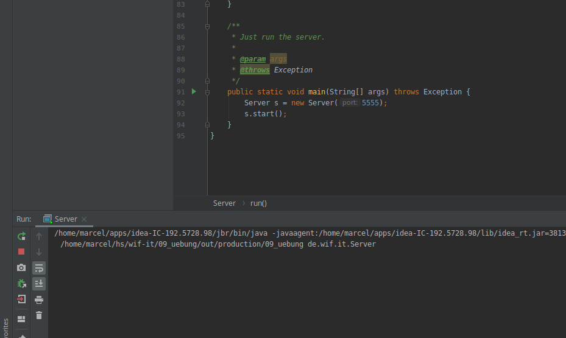

_Übungsaufgabe zur Veranstaltung [IT
Systeme](https://hsro-wif-it.github.io) im [Bachelorstudiengang
Wirtschaftsinformatik](https://www.th-rosenheim.de/technik/informatik-mathematik/wirtschaftsinformatik-bachelor/) an der [Hochschule Rosenheim](http://www.th-rosenheim.de)._

# 09 - Verteilte Anwendungen

Diese Übung behandelt das Thema _verteilte Anwendungen_ und vertieft dabei die
Themen IP Addressing, Sockets, UDP und Client/Server.

> Note: **Die Lösung befindet sich im Branch _Musterlösung_.**

## Aufgabe 1: UDP Socket Server und Client in Java

Verbessern wir unser einfaches Chat-Systeme. Diesmal starten wir mit einem existierenden Server. Dieses ist ein UDP Server und erwartet _DataGrams_.

Dabei unterstütz der Server folgende 2 Nachrichten:

1. `GET @<username>` : Liefert die Nachrichten seit der letzten Abfrage für den User (<username>) zurück. Ist das Format falsch, wird 500 (interner Fehler) zurückgegeben.

2. `@<toUser> @<fromUser> <message>`: Verschickt eine Nachricht (<message>) an <username>. Ist das Format falsch, wird 500 (interner Fehler) zurückgegeben.

Der Code für den Server befindet sich in [./src/main/java/de/wif/it](./src/main/java/de/wif/it) und kann über die `main`-Methode in Server.java gestartet werden.

> Note: Setzen Sie einen entsprechenden Port!

a)

Starten Sie den Server auf ihrem Computer! Das können Sie diesmal auch aus IntelliJ machen!

b)

Schreiben Sie ein Client-Programm, dass entsprechende UDP Datagrams an den Server schickt.

1. Schreiben Sie ein Klasse `Client`, die im Konstruktor `public Client(String user, String IPAdress, int port)` den User, di IPAdresse und den Port übergeben bekommt.
1. Schreiben Sie die Methode `public void sendMsg(String msg)`. Diese Methode schickt das passende Datagram und gibt eine mögliche Rückantwort auf `System.out` aus.
1. Schreiben Sie die Methode  `public void getMsgs()`. Diese Methode schickt das passende Datagram, um NAchrichten vom Server zu holen und gibt das Resultat auf `System.out` aus.
1. Schreiben Sie eine `main` Methode, in der Sie eine Instanz von `Client` erzeugen und die beiden Methoden testen.
1. Schreiben Sie eine weitere Methode `run`, die kontinuierlich Benutzereingaben, der Form `@<user> @From Hallo` aufnimmt und an den Server verschickt. Verwenden Sie hierzu die `sendMsg` Methode
1. Vergessen Sie nicht Ihre Nachrichten auch abzurufen.

c)

Wenn ihr Client soweit funktioniert, verbinden Sie ihren Client mit dem "richtigen" Server, damit Sie auch mit anderen kommunizieren können!

> Note: Die IP Adresse bekommen Sie in der Übung.

d)

Sie sehen, diesmal ist es _keine_ Echtzeit-Kommunikation, sondern ein Client muss die Nachrichten explizit abholen (im klassischen Client/Server Modell).

1. Diskutieren Sie mit ihrem Nachbarn/in mögliche Architektur-Konzepte und mögliche Lösungsstrategien, wie Sie das "Abholen" der Nachrichten umsetzen können.
1. Welche Vor- und Nachteile gibt es?

> Note: Eine mögliche Variante kombiniert verschiedene Interaktionsmodelle für verteilte Architekturen!
